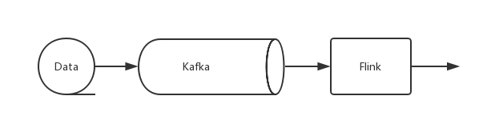

layout: post
comments: true
date: 2018-10-27
title: 
categories:  

- Flink
- Big Data

最近一段时间负责公司的流计算平台，将此中感悟和一些学习总结汇聚成文，陆续发布。

#1. 流计算架构

先说说流计算架构。

对于后端数据而言，典型的传统架构是采用一个中心化的数据库系统，该系统用于存储事务性数据，应用程序依靠数据库系统实现。姑且称为传统架构。

随着分布式系统的发展，开始出现了以数据流为基础的架构。以流为基础的架构设计让数据记录持续的从数据源流向应用程序，并在各个应用程序之间持续流动，没有数据库来集中存储全局状态数据，取而代之的是共享且永不停止的流数据。 

如上图所示，我们将系统分为两个部分——消息传输层和流处理层：

1. 消息传输层（如上图中的Kafka）从各数据源采集连续事件产生的数据，并传输给订阅了这些数据的应用程序和服务。
2. 流处理层（如上图中的Flink）有三个用途：持续的在应用程序和系统间移动数据；聚合并处理时间；在本地维持应用程序的状态。

在流处理架构中，消息传输层很关键。首先，要求消息传输层兼具***高效性***和***持久性***，高效才能支持大数据量，持久性让消息可重播，从而才可能让流处理层进行***再计算***；其次，将生产者和消费者***解耦***，这样，消费者可以立即使用消息，也可以不立即对消息进行处理，甚至当消息到达时，消费者可以不处于运行状态，这有利于支持***微服务***。可以看出，Kafka 是很适合用于消息传输层的。

从上可以看出，流计算架构的核心是使各应用程序互联的消息队列。流处理层从消息队列订阅数据并加以处理，处理完成后数据可以流向另一消息队列。

# 2. Why Flink

> Apache Flink is an open source platform for distributed stream and batch data processing. Flink’s core is a streaming dataflow engine that provides data distribution, communication, and fault tolerance for distributed computations over data streams. Flink builds batch processing on top of the streaming engine, overlaying native iteration support, managed memory, and program optimization.

关于Flink的特点等文章太多，推荐参考[阿里巴巴为什么选择Apache Flink](https://mp.weixin.qq.com/s/AoSDPDKbTbjH9rviioK-5Q)。我简单总结下。

Flink 是一个开源的分布式流计算和批处理平台，基于统一的流式执行模型，将批处理当作特殊的流计算，从而将流计算和批处理统一起来。避免了离线计算和实时计算同一套逻辑实现两次的负担（如labmda架构）。

Flink 能够保障流计算的***正确性***。Flink 的一大优势是使应用程序的构建符合自然规律，比如，Flink 中的窗口函数的定义符合数据产生的自然规律，比如支持的会话窗口，保障***正确性***；其次，Flink 完美支持事物时间，且能区分不同类型的时间，从而保障应用的***正确性***；再次，Flink 通过检查点技术，实现了即使在发生故障后也能保障准确，支持Exactly-once语义，保障***正确性***。

其次，Flink 具有高吞吐、低延迟、高性能的特点。

支持大规模的集群模式，支持Yarn、Mesos，可运行于成千上万节点。

最后，Flink SQL 便于使用。

# 3. 总结

本文主要是流计算架构的介绍和为什么选Flink的一个总结，下一篇将开始讲具体的Flink 技术。