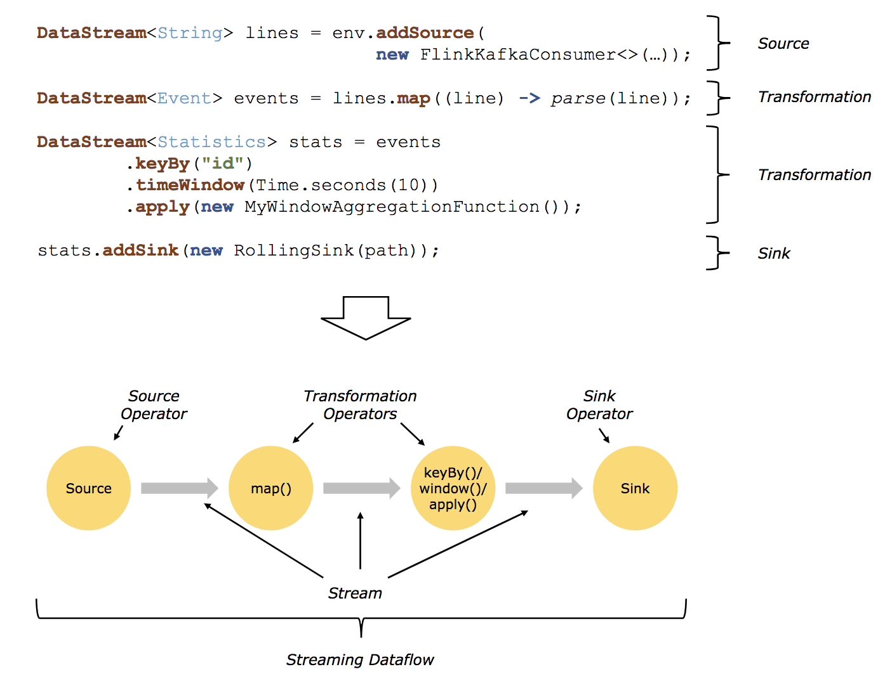

本文转自个人微信公众号，[原文链接](https://mp.weixin.qq.com/s/4ySScrUpXTJoCtRP0feitg)。

> Apache Flink is a framework and distributed processing engine for stateful computations over *unbounded and bounded* data streams. Flink has been designed to run in *all common cluster environments*, perform computations at *in-memory speed* and at *any scale*.

# 1 概念

## 1.1 Bounded Streams VS Unbounded Streams & 批处理 VS 流处理

Bounded Streams 可以理解为有开始也有结束的数据流，处理这类数据流可以等所有数据都到了再处理，也就是常说的**批处理**。

Unbounded Streams 可以理解为有开始没有结束的数据流，这类数据流持续产生数据，所以，也要持续的进行处理而不能等数据流结束再处理，也就是常说的**流处理**。

Apache Flink 既能处理Bounded Streams 也擅长处理Unbounded Streams，既能做批处理也能做流处理。

## 1.2 部署方式

Apache Flink 是一个分布式系统，需要资源以运行其它应用，Apache Flink 支持常见的资源管理器，包括Yarn、 Mesos、K8S，也可以以Stand-Alone Cluster的方式运行。

## 1.3. Runtime

Apache Flink Runtime 是一个典型的master-slave架构， 包括Jobmanagers 和 Taskmanagers 两部分：

* Jobmanagers (masters)：协调分布式执行，包括调度任务、协调checkpoints、从失败恢复等。一般至少需要一个Jobmanager，在HA环境下，需要有多个Jobmanagers，其中有一个作为leader，其他的standby。
* taskmanagers (workers)：执行具体的任务，buffer和传递数据流。

另外，Clients 不是Apache Flink Runtime的一部分，但常用于准备和提交Job到 Jobmanager。

## 1.4 编程模型

### 1.4.1 抽象

Apache Flink 提供了不同的抽象级别以开发Flink 应用。

* Stateful Streaming：抽象级别最低，给应用开发者提供了最大的自由度，实际开发中很少使用。
* DataStream / DataSet API： 这是Flink 提供的核心APIs，DataStream API 用于Unbounded Stream Data，DataSet API 用于Boundesd Stream Data，用于使用各种方法对数据进行计算处理，如map等。
* Table API：以***表***为核心的的声明式DSL，该表可以是动态变化的表，该层API提供了诸如Select、Join、Group-by、Aggregate之类的操作，更加简洁。另外，用户可以在Table API和Dataset/Datastream API 之间无缝切换甚至混用。
* SQL：跟Table API相似，只不过是以SQL的方式进行描述。

### 1.4.2 程序与Dataflows

Apache Flink 程序一般包括**data streams**和 **transformations** 两部分，其中，data streams 是数据流，transformations 是操作数据流的算子，以一个或多个数据流为输入，输出一个或多个数据流。

当Apache Flink 程序运行时，Flink 程序可以理解为包含**streams** 和 transformation **operators** 的**streaming dataflow**，每个dataflow 以一个或多个sources开始并以一个或多个sinks 结束，这个dataflow 类似于DAGs（directed acyclic graphs）。（有没有一种熟悉的感觉，比如Spark、Flume...）

* ***Sources***：数据源，常见的如kafka。
* ***Transformations***：数据转换，可以理解为对数据的操作。
* ***Sinks***：接收器，Flink 转换后将数据发送到的地方。

### 1.4.3 其它重要概念

#### 1.4.3.1 Time

在流计算中，Time包括三种：

* Ingestion Time：数据记录进入Flink Data Source的时间。
* Processing Time：Flink Operator进行time-based 操作的本地时间。
* Event Time：数据的时间，一般有业务意义。

Apache 可以支持这三种Time，每种Time都有特定的用途，后序文章会详细进行说明。

#### 1.4.3.2 Window

不同于批计算，流计算的计算一般是针对一个窗口的数据的计算，比如“统计过去5分钟的记录数”、“过去100个数据的平均值”等。

窗口包括按时间进行划分的和按数据进行划分的，典型的包括 ***tumbling windows***、 ***sliding windows***, ***session windows***，每种窗口应用于不同的场景。

#### 1.4.3.3 State

有些操作只需要知道当前数据记录即可，还有些操作需要其它数据记录，我们称这种操作是***stateful operations***，比如要计算Sum、Avg等，这些值是需要存储的，因为会不断变化，这些值就可以理解为 ***state***。

Apache Flink 提供了内置的状态管理，这也是Flink 区别于其它流计算引擎的最主要的区别。

#### 1.4.3.4 Checkpoint

Apache Flink的checkpoints 可以理解为输入数据流在某一点以及所有operators对应的state，Apache Flink 基于checkpoints 和 stream replay 实现容错，并基于此实现数据一致性（exactly-once）。

# 2 Why Flink

上面主要介绍Flink 中的核心概念，总结下为什么选择Flink：

1. Apache Flink 是一个低延迟、高吞吐、统一的大数据计算引擎。
2. 支持状态管理，提供有状态的计算。
3. 提供准确的结果，即使出现数据乱序或数据延迟。Flink 程序符合自然规律，如多种窗口、event time等能满足正确性的要求，而且，基于checkpoint 和replay 提供故障恢复，支持 Exactly-Once 语义，保障正确性。
4. 支持Yarn / Mesos / K8S等多种资源管理器，可以方便扩展。
5. 是一个批流统一的平台，在未来，批流融合是一大趋势。
6. Flink SQL 降低了使用门槛，便于推广。

下篇文章，开始编写第一个Flink 程序。

扫描下方二维码关注我。

