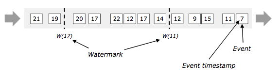

本文转自个人微信公众号，[原文链接](https://mp.weixin.qq.com/s/sJa3yGENCaDHd-LHz5jFsg)。

如 [上篇](https://mp.weixin.qq.com/s/4ySScrUpXTJoCtRP0feitg) 所述，Flink 里时间包括Event Time、Processing Time 和 Ingestion Time 三种类型。

* Processing Time：Processing Time 是算子处理某个数据时到系统时间。Processing Time 是最简单的时间，提供了最好的性能和最低的延迟，但是，在分布式环境中，Processing Time具有不确定性，多次运行的结果可能出现不一致。
* Ingestion Time：Ingestion Time 是数据进入Flink 集群的时间，Source Operator 给数据加上时间戳。
* Event Time：Event Time是数据在设备上产生时的时间，一般都嵌入到了数据记录中，相比于其他两种，Event Time 更具有业务意义， 取决于数据而不是系统。举例来说，重跑历史数据时，如果根据Processing Time 重跑，可能会造成结果不一致，而根据Event Time 重跑，结果是一致的。

由于Event Time 更能表达业务需求，所以，Event Time 应用更为广泛，但使用Event Time 也会存在一些问题。

# 1. 问题：乱序与延迟

乱序与延迟是实时系统中最常见的问题。比如说，在实时系统中广泛使用的消息队列，很难保证端到端的全局有序，从而导致进入 Flink 集群的数据是无序的；然后，由于洪峰的存在，比如秒杀或者重跑历史数据，很容易造成数据在消息队列堆积，从而造成延迟。

# 2. 解决方案

采用Event Time的流计算处理器，需要评估Event Time进展，比如当窗口结束时，需要通知 Operator 关闭窗口并开始计算。

## 2.1 Watermark 

 Apache Flink 采用watermark来处理，watermark 带有一个时间戳，作为数据流的一部分随数据流流动，`Watermark(t)` 表示event time 小于等于 `t` 的都已经到达，如下图所示。



### 2.1.1 生成Watermark

#### 2.1.1.1 方法1 Source 中生成

在source中，直接生成watermark，不过，source生成的watermark 优先级比较低，可以被方法2中的覆盖掉。具体的定义在一篇讲Source & Sink 时详述。

#### 2.1.1.2 方法2 Timestamp Assigner

Timestamp Assigner 输入数据流，产生一个新的数据流，新数据流带有产生的watermark，如果原数据流本身就有watermark，则覆盖原watermark。Timestamp Assigner 一般紧跟在source后，但不是必须的，但是必须在第一个event time 操作前。

Timestamp Assigner 分两种：

* ***Periodic***： 周期性（一定时间间隔或一定数据量）产生watermark。
* ***Punctuated***： 间断的 watermark，一般根据event 决定是否产生新watermark。

**Periodic**

直接看源码(注释太明白，不舍得删)。

```scala
/**
 * A {@code TimestampAssigner} assigns event time timestamps to elements.
 * These timestamps are used by all functions that operate on event time,
 * for example event time windows.
 *
 * <p>Timestamps are represented in milliseconds since the Epoch
 * (midnight, January 1, 1970 UTC).
 *
 * @param <T> The type of the elements to which this assigner assigns timestamps.
 */
public interface TimestampAssigner<T> extends Function {

	/**
	 * Assigns a timestamp to an element, in milliseconds since the Epoch.
	 *
	 * <p>The method is passed the previously assigned timestamp of the element.
	 * That previous timestamp may have been assigned from a previous assigner,
	 * by ingestion time. If the element did not carry a timestamp before, this value is
	 * {@code Long.MIN_VALUE}.
	 *
	 * @param element The element that the timestamp will be assigned to.
	 * @param previousElementTimestamp The previous internal timestamp of the element,
	 *                                 or a negative value, if no timestamp has been assigned yet.
	 * @return The new timestamp.
	 */
	long extractTimestamp(T element, long previousElementTimestamp);
}
```

```scala
/**
 * The {@code AssignerWithPeriodicWatermarks} assigns event time timestamps to elements,
 * and generates low watermarks that signal event time progress within the stream.
 * These timestamps and watermarks are used by functions and operators that operate
 * on event time, for example event time windows.
 *
 * <p>Use this class to generate watermarks in a periodical interval.
 * At most every {@code i} milliseconds (configured via
 * {@link ExecutionConfig#getAutoWatermarkInterval()}), the system will call the
 * {@link #getCurrentWatermark()} method to probe for the next watermark value.
 * The system will generate a new watermark, if the probed value is non-null
 * and has a timestamp larger than that of the previous watermark (to preserve
 * the contract of ascending watermarks).
 *
 * <p>The system may call the {@link #getCurrentWatermark()} method less often than every
 * {@code i} milliseconds, if no new elements arrived since the last call to the
 * method.
 *
 * <p>Timestamps and watermarks are defined as {@code longs} that represent the
 * milliseconds since the Epoch (midnight, January 1, 1970 UTC).
 * A watermark with a certain value {@code t} indicates that no elements with event
 * timestamps {@code x}, where {@code x} is lower or equal to {@code t}, will occur any more.
 *
 * @param <T> The type of the elements to which this assigner assigns timestamps.
 *
 * @see org.apache.flink.streaming.api.watermark.Watermark
 */
public interface AssignerWithPeriodicWatermarks<T> extends TimestampAssigner<T> {

	/**
	 * Returns the current watermark. This method is periodically called by the
	 * system to retrieve the current watermark. The method may return {@code null} to
	 * indicate that no new Watermark is available.
	 *
	 * <p>The returned watermark will be emitted only if it is non-null and its timestamp
	 * is larger than that of the previously emitted watermark (to preserve the contract of
	 * ascending watermarks). If the current watermark is still
	 * identical to the previous one, no progress in event time has happened since
	 * the previous call to this method. If a null value is returned, or the timestamp
	 * of the returned watermark is smaller than that of the last emitted one, then no
	 * new watermark will be generated.
	 *
	 * <p>The interval in which this method is called and Watermarks are generated
	 * depends on {@link ExecutionConfig#getAutoWatermarkInterval()}.
	 *
	 * @see org.apache.flink.streaming.api.watermark.Watermark
	 * @see ExecutionConfig#getAutoWatermarkInterval()
	 *
	 * @return {@code Null}, if no watermark should be emitted, or the next watermark to emit.
	 */
	@Nullable
	Watermark getCurrentWatermark();
}
```

可以看出，自定义的Assigner 需要实现`AssignerWithPeriodicWatermarks` 接口，其中`getCurrentWatermark` 产生新的watermark，如果返回非空且大于原来的watermark，则生成了新的watermark；另外，`extractTimestamp` 用于给数据加上时间戳，这个时间戳在后续所有基于event time的计算中使用。以下面的代码为例，假设数据可能乱序，但最多延迟3.5秒。

```scala

/**
 * This generator generates watermarks assuming that elements arrive out of order,
 * but only to a certain degree. The latest elements for a certain timestamp t will arrive
 * at most n milliseconds after the earliest elements for timestamp t.
 */
class BoundedOutOfOrdernessGenerator extends AssignerWithPeriodicWatermarks[MyEvent] {
    val maxOutOfOrderness = 3500L // 3.5 seconds
    var currentMaxTimestamp: Long = _
    override def extractTimestamp(element: MyEvent, previousElementTimestamp: Long): Long = {
        element.getCreationTime()
    }

    override def getCurrentWatermark(): Watermark = {
        // return the watermark as current highest timestamp minus the out-of-orderness bound
        new Watermark(currentMaxTimestamp - maxOutOfOrderness)
    }
}
```

`ExecutionConfig.setAutoWatermarkInterval(...) ` 定义了watermark产生的时间间隔，单位是毫秒。

**Punctuated**

根据event来确定是否需要产生新的watermark，定义Punctuated Assigner 需要实现`AssignerWithPunctuatedWatermarks`接口，包括函数`extractTimestamp`，`checkAndGetNextWatermark`，其中`extractTimestamp` 同Periodic Assigner，首先调用；然后调用`checkAndGetNextWatermark` ，用于确定是否需要产生新的watermark，当`checkAndGetNextWatermark` 产生一个非空且大于上一个watermark时就产生了新的watermark。举个例子如下：

```scala
class PunctuatedAssigner extends AssignerWithPunctuatedWatermarks[MyEvent] {

	override def extractTimestamp(element: MyEvent, previousElementTimestamp: Long): Long = {
		element.getCreationTime
	}

	override def checkAndGetNextWatermark(lastElement: MyEvent, extractedTimestamp: Long): Watermark = {
		if (lastElement.hasWatermarkMarker()) new Watermark(extractedTimestamp) else null
	}
}
```

### 2.1.2  Flink 预定义Timestamp Assigner

为了便于使用，Apache Flink 提供了两种预定义的Timestamp Assigner：

* **AscendingTimestampExtractor**： 这是`AssignerWithPeriodicWatermarks` 的最简单的情况，数据流是按时间戳升序到达Flink的，这种情况下，数据里的时间戳就可以作为watermark

  ```scala
  val withTimestampsAndWatermarks = stream.assignAscendingTimestamps( _.getCreationTime )
  ```

* **BoundedOutOfOrdernessTimestampExtractor**: 这也是一个`AssignerWithPeriodicWatermarks` 的实现，表示已知数据的最大延迟。

  ```scala
  val withTimestampsAndWatermarks = stream.assignTimestampsAndWatermarks(new BoundedOutOfOrdernessTimestampExtractor[MyEvent](Time.seconds(10))( _.getCreationTime ))
  ```

这两种Timestamp Assigner 一是可以直接使用，二是可以作为学习的代码示例。

## Latency

即使采用watermark 技术，对于watermark(t) 也可能存在时间戳小于t却没有到达的数据，在现实中，延迟可能是无上限的，这种情况下，不可能无限等待下去；另外，即使延迟有限，但如果让watermark 延迟太多也不好，因为延迟太多可能就失去了实时的意义。所以，必须要作出选择。

默认情况下，延迟超过watermark的数据会被丢弃，但 Flink 允许在窗口操作上指定最大延迟，我们用N表示支持的最大延迟（N默认为0），对于窗口 [start_time, end_time)] ，数据迟于 watermark(t) 但先于end_time+N到达的，仍然会添加到窗口中再次触发计算。为了支持这种情况，Flink 需要保持这个窗口state 到时间戳 end_time + N ，当时间到达end_time+N后，Flink 删除窗口和state。

```scala
stream
    .keyBy(<key selector>)
    .window(<window assigner>)
    .allowedLateness(<time>)
    .<windowed transformation>(<window function>)
```

# 3. 总结

本文主要介绍Flink 中Event Time 和Watermark。由于Event Time 具有业务意义，且具有确定性，所以Event Time 应用广泛，但由于在现实中存在延迟和乱序问题，Flink 采用了 Watermark 来解决这个问题。 

扫描下方二维码关注我。


