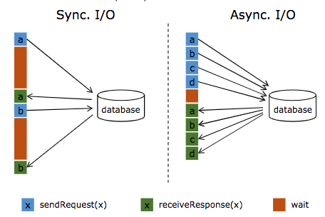
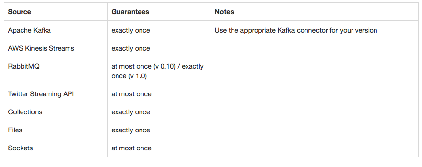

本文基于Apache Flink 1.7。

Source 就是Flink 程序的数据输入，Flink 提供了多种数据输入方式，下面逐一介绍。

# 概念

## Flink预定义Sources

Flink 预定义了多种Sources。

* 基于文件的，如`readTextFile(path)`、`readFile(fileInputFormat, path)`等;
* 基于socket的，如`socketTextStream`；
* 基于collections and iterators的，如`fromCollection(Seq)`、`fromElements(elements: _*)`等，常用于开发测试。

## Connectors

connectors 用于给接入第三方数据提供接口，现在支持的connectors 包括：

* Apache Kafka
* RabbitMQ
* Apache NiFi
* Twtter Streaming API
* Amazon Kinesis Streams

另外，通过 [Apache Bahir](https://bahir.apache.org/)，可以支持ActiveMQ/Netty之类的Source。

## Async I/O API

Flink 提供了外部数据存储的异步I/O API。流计算中经常需要与外部存储系统交互，比如取某个表的数据以便跟流中数据进行关联，一般来说，如果用同步I/O的方式，会造成系统中出现大的等待时间，影响吞吐和延迟。为了解决这个问题，异步I/O可以并发处理多个请求，提高吞吐，减少延迟，如下图所示。



## Queryable State

如果Flink 应用需要将大量数据写到外部存储，这时候很容易产生I/O 瓶颈，如果需要写的数据是读少写多的数据，那么是否可以让外部应用自己来拉取数据呢？Queryable State 就是这个用途，提供了接口给外部应用，允许外部应用根据需要查询Flink state，现阶段Queryable State 还是Beta版，期待ing。

# 容错

Flink 提供了容错机制，以便Jobs从Failure恢复并继续执行，Flink 提供source的 exactly-once需要source的支持，如下图所示（注：图片来源于Flink 官网）：



# 实战

## 预定义Sources

预定义的Source比较简单，在程序开发、调试阶段，可以采用基于Collection的Source，举例来说：

```scala
val env = StreamExecutionEnvironment.getExecutionEnvironment
env.setStreamTimeCharacteristic(TimeCharacteristic.ProcessingTime)
val stream = env.fromCollection(List(1,2,3,4,5))
stream.print
env.execute
```

## Kafka Connector

Connectors 就以最常用的Kafka Connectors来说。Flink 提供了Flink Kafka Consumer 读取Kafka topics的数据，Flink Kafka Consumer 集成了Flink的checkpoint 机制以提供**exactly-once** 语义，不仅以来Kafka Consumer 的offset 追踪，同时将这些信息存到checkpoint。

Kafka Connector 在Flink 1.7.0后有大的改动，但还处于beta阶段，所以，下面还是以**flink-connector-kafka-0.11_2.11** 为例，而且，我们在生产环境也是用的这个版本。大家也可以用最新的**flink-connector-kafka_2.11**，这是一个通用版本，兼容0.10.0后边的版本。

首先，在项目中import Flink Kafka Connector。

```xml
<dependency>
	<groupId>org.apache.flink</groupId>
	<artifactId>flink-connector-kafka-0.11_${scala.binary.version}</artifactId>
	<version>${flink.version}</version>
</dependency>
```

代码如下：

```scala
/** 注释1
 * 启动checkpoint（可选）
 * env.enableCheckpointing(5000); //checkpoint every 5000 msecs
 */
val properties = new Properties();
properties.setProperty("bootstrap.servers", "127.0.0.1:9092");
properties.setProperty("group.id", "groupXXX");
/** 注释2
 * 下面配置读取kafka topic partition 的起始偏移量（可选）
 * consumer.setStartFromEarliest();
 * consumer.setStartFromLatest();
 * consumer.setStartFromTimestamp(...);
 * consumer.setStartFromGroupOffsets();  // 默认
*/
val consumer = new FlinkKafkaConsumer011[]("topic_name", SimpleStringSchema, properties)
/** 注释3
 * Watermark （可选）
 * consumer.assignTimestampsAndWatermarks(new CustomWatermarkEmitter());
 */
val stream = env.addSource(consumer)
```

**1. 构造函数** ，需要三个参数：

* topic 名
* 反序列化方法
* Kafka consumer的Properties

**2. checkpoint**，从注释1 可以看出，Flink Kafka Consumer 可以启动checkpoint机制，会周期性的给Kafka offsets 和 Flink的其它states 做 checkpoints，当Job 失败时，Flink 读取checkpoint里最新的state并从对应offset 开始消费数据恢复运算。

**3. 起始偏移量**，从注释2可以看出，Flink Kafka Consumer 允许设置读取 Kafka Partition的起始偏移量，而且，允许不同Partitions 分别进行设置。但要注意，设置起始偏移量**不适用**于两种情况：

* Job 从failure 自动恢复。
* 手动从某savepoint 启动任务。

**4. Kafka Topic 和Partition 自发现**，比如构建Kafka Consumer时，topic名可以是正则表达式，这时候，如果有符合该正则的新的topic 加入到Kafka 集群，可以被自动发现；另外，如果对Kafka Topic 进行RePartition，也可以自动发现，使用不多，可以自行查阅文档。

**5. Kafka Consumer与Watermark** ，从注释3可以看出，结合[上篇文章](https://mp.weixin.qq.com/s/sJa3yGENCaDHd-LHz5jFsg)，可以给数据设置方法以便给数据带上watermark。

# 总结

本文主要以 Flink Kafka Connector 为例讲了Flink 里的Sources，主要是考虑Kafka广泛使用在实时系统中，甚至可以说是标配，后边将开始讲解Sink以及Flink SQL。

看到这里，请扫描下方二维码关注我，Happy Friday !


