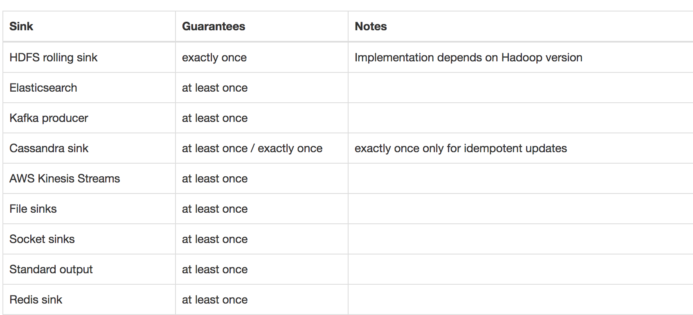
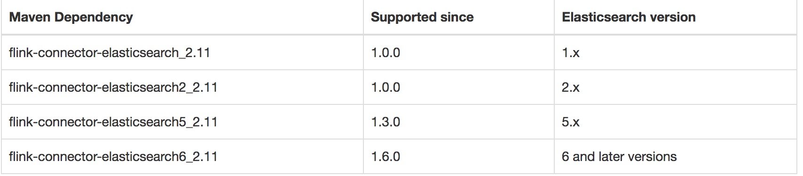

本文基于Apache Flink 1.7。

结合上一篇文章，Source 是 Flink 程序的输入，Sink 就是 Flink 程序处理完Source后数据的输出，比如将输出写到文件、sockets、外部系统、或者仅仅是显示（在大数据生态中，很多类似的，比如Flume里也是对应的Source/Channel/Sink），Flink 提供了多种数据输出方式，下面逐一介绍。

# 概念

## Flink 预定义 Sinks

* 基于文件的：如 `writeAsText()`、`writeAsCsv()`、`writeUsingOutputFormat`、`FileOutputFormat`。
* 写到socket： `writeToSocket`。
* 用于显示的：`print`、`printToErr`。
* 自定义Sink： `addSink`。

对于`write*` 来说，主要用于测试程序，Flink 没有实现这些方法的检查点机制，也就没有 **exactly-once** 支持。所以，为了保证 **exactly-once** ，需要使用 **flink-connector-filesystem**，同时，自定义的`addSink` 也可以支持。

## Connectors

connectors 用于给接入第三方数据提供接口，现在支持的connectors 包括：

* Apache Kafka
* Apache Cassandra
* Elasticsearch
* Hadoop FileSystem
* RabbitMQ
* Apache NiFi

另外，通过 [Apache Bahir](https://bahir.apache.org/)，可以支持Apache ActiveMQ、Apache Flume、Redis、Akka之类的Sink。

## 容错

为了保证端到端的 **exactly-once**，Sink 需要实现checkpoint 机制，下图(图片来自于官网)所示的Sink 实现了这点。.

# 实战

## Elasticsearch Connector

下面我们将使用 Elasticsearch Connector 作为Sink 为例示范Sink的使用。Elasticsearch Connector 提供了**at least once** 语义支持，at lease once 支持需要用到Flink的checkpoint 机制。

要使用Elasticsearch Connector 需要根据Elasticsearch 版本添加依赖，如下图所示(图片来自官网)。

在这里，我们使用的Elasticsearch 版本是5.6.9，Scala 版本2.11。

添加如下依赖：

```xml
<dependency>
    <groupId>org.apache.flink</groupId>
    <artifactId>flink-connector-elasticsearch5_2.11</artifactId>
    <version>${flink.version}</version>
</dependency>
```

先看ElasticsearchSink 源码，我们需要定义 ElasticsearchSinkFunction<T> 以及可选的 ActionRequestFailureHandler，ActionRequestFailureHandler 用来处理失败的请求。

```scala
public class ElasticsearchSink<T> extends ElasticsearchSinkBase<T, TransportClient> {
    private static final long serialVersionUID = 1L;

    public ElasticsearchSink(Map<String, String> userConfig, List<InetSocketAddress> transportAddresses, ElasticsearchSinkFunction<T> elasticsearchSinkFunction) {
        this(userConfig, transportAddresses, elasticsearchSinkFunction, new NoOpFailureHandler());
    }

    public ElasticsearchSink(Map<String, String> userConfig, List<InetSocketAddress> transportAddresses, ElasticsearchSinkFunction<T> elasticsearchSinkFunction, ActionRequestFailureHandler failureHandler) {
        super(new Elasticsearch5ApiCallBridge(transportAddresses), userConfig, elasticsearchSinkFunction, failureHandler);
    }
}
```

下面看完整的例子：

```scala
package learn.sourcesAndsinks

import java.net.{InetAddress, InetSocketAddress}
import java.util

import org.apache.flink.api.common.functions.RuntimeContext
import org.apache.flink.streaming.connectors.elasticsearch.{ElasticsearchSinkFunction, RequestIndexer}
import org.apache.flink.streaming.api.TimeCharacteristic
import org.apache.flink.streaming.api.scala.{StreamExecutionEnvironment, _}
import org.apache.flink.streaming.connectors.elasticsearch.util.IgnoringFailureHandler
import org.apache.flink.streaming.connectors.elasticsearch5.ElasticsearchSink
import org.elasticsearch.action.index.IndexRequest
import org.elasticsearch.client.Requests

object BasicSinks {
  def main(args: Array[String]): Unit = {
    val env = StreamExecutionEnvironment.getExecutionEnvironment
    env.setStreamTimeCharacteristic(TimeCharacteristic.ProcessingTime)

    // 定义stream  
    val stream: DataStream[String] = env.fromCollection(List("aaa", "bbb", "ccc"))

    // Elasticsearch 相关配置，ES 用 docker 起的，所以cluster.name 是默认的docker-cluster
    val config = new util.HashMap[String, String]()
    config.put("cluster.name", "docker-cluster")
    config.put("bulk.flush.max.actions", "1")
    val transportAddress = new util.ArrayList[InetSocketAddress]()
    transportAddress.add(new InetSocketAddress(InetAddress.getByName("127.0.0.1"), 9300))

    stream.addSink(new ElasticsearchSink(
      config,
      transportAddress,
      new ElasticsearchSinkFunction[String] {
        def createIndexRequest(element: String): IndexRequest = {
          val json = new util.HashMap[String, String]()
          json.put("data", element)

          return Requests.indexRequest()
            .index("my-index")
            .`type`("my-type")
            .source(json)
        }
        def process(element: String, ctx: RuntimeContext, indexer: RequestIndexer) = {
          indexer.add(createIndexRequest(element))
        }
      },
      // 忽略错误，示例用，不建议用于生产环境
      new IgnoringFailureHandler()
      ))

    env.execute()
  }
}

```

如下图所示，是上面程序的结果。

上面实现了一个基础的Elasticsearch Sink，为了保证数据完整性，需要添加一些重试策略，这些主要跟 Elasticsearch 相关。

> ES flush 相关配置
>
> bulk.flush.max.actions
> bulk.flush.max.size.mb
> bulk.flush.interval.ms
>
> ES 错误重试配置
>
> bulk.flush.backoff.enable
> bulk.flush.backoff.type
> bulk.flush.backoff.delay
> bulk.flush.backoff.retries

如果在此基础上还需要处理Elasticsearch 的报错，可以自己实现ActionRequestFailureHandler 方法。

# 总结

本文主要以 Flink Elasticsearch Connector 为例讲了Flink 里的Sink，后面会对Source 和 Sink 进行源码解读。

看到这里，请扫描下方二维码关注我，Happy Friday !


