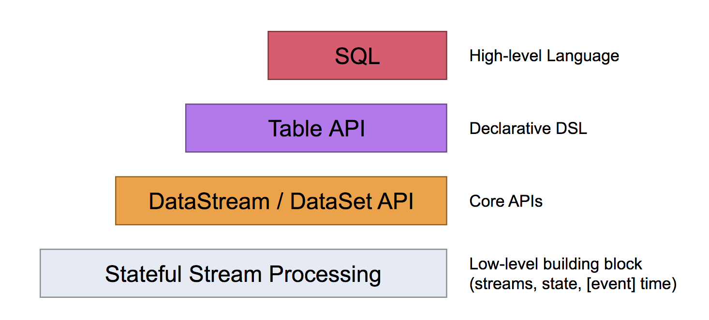

本文基于 Flink 1.7。

随着 Hadoop 的发展，有了Hive，使用HQL 即可完成原来繁琐的Map Reduce 程序。

随着 Spark的发展，引入了 Spark SQL。

随着 Flink 版本的更迭，Flink 也提供了Flink SQL，以及 Table APIs。

注意：截止 Flink 1.7，Table API 和 SQL 还没有完成，有些操作还不支持。

# 1. 基本概念

## 1.1 Why

那么，为什么要推出Table APIs和SQL？

首先，来看下Flink 的编程模型。如下图所示（图片来源于官网），DataStream API 和 DataSet API 是分开的，但是对于应用开发者来说，为什么要关注这一点？对于相同的数据，批处理与流计算居然要写两套代码，简直不可思议。Table APIs和SQL的推出，实现了流处理和批处理的统一。

其次，降低了学习和使用门槛，基于 DataStream/DataSet APIs 的 Scala 或 Java 程序开发，对于BI/分析师来说，还是有一定门槛的，而SQL 则简单太多了。

## 1.2 Dynamic Tables

Dynamic Tables 是 Flink Table API 和 SQL的核心概念，与大家熟知的Static Tables 相比，Dynamic Tables 随着时间一直在变化。可以查询Dynamic Table，查询Dynamic Table 时会产生一个持续的查询，持续的查询不会终止，产生的结果也是Dynamic Table，根据输入，输出也会不断变化。熟悉关系型数据库的可以将Dynamic Tables的查询跟关系型数据库里查询物化视图对比起来，需要注意的是，Dynamic Tables 是一个逻辑概念，不需要（全部）物化。

另外，需要注意，在Dynamic Table上的持续查询的结果语义上是跟在Dynamic Table的快照上执行查询相同。


如上图所示：

* Stream 转化为 Dynamic Table
* 在Dynamic Table 上执行查询，得到的结果是一个新的Dynamic Table
* 最终的Dynamic Table 结果，被转化为 Stream

## 1.3 Update Queries VS Append Queries

Append Queries：只会对查询结果进行追加的查询。

Update Queries：会更新查询结果的查询，一般需要维护更多的state。

## 1.4 查询限制

有些 Stream 上的查询需要花费巨大的代价：

* 需要维护的state 太大。持续查询可能会运行非常长的时间，处理的数据量会非常大，对于一些需要更新原来结果的查询，需要维护原来的结果，维护的state会很大。
* 更新计算代价高昂：输入数据的一小点变化，可能有些查询需要重新计算大量的数据，这种计算就不适合做持续查询。

## 1.5 Table 到 Stream 的转化

就像普通的数据库Table 一样，Dynamic Table也支持 `insert`、`update`、`delete`等对它的更新。当需要将Dynamic Table 转化为 Stream 或者输出到外部系统时，需要对这些更新进行`encode`。

* Append-only Stream：仅有Insert 更新的Dynamic Table，可通过emit 插入的数据行转化为stream。
* Retract Stream：Retract Stream 是支持 add 消息 和 retract 消息两类消息的流。将insert 编码为add 消息、将delete 编码为retract 消息、将update 编码为对之前消息的retarct 消息和对新消息的add消息。
* Upsert Stream：Upsert Stream 是支持upsert 消息和delete消息两类消息的流。如果一个Dynamic Table需要转化为一个Upsert Stream，这个Table 必须要有`unique key`，可以将insert/update编码为upsert 消息，将delete 编码为delete消息。Upsert Stream 与 Retract Stream的主要区别是update 操作只需要一条消息，所以会更高效。

Append-only Stream 和 Retarct Stream 支持将Dynamic Table 转化为DataStream。 

# 2. 实战

下面引入一个简单的例子，从stream开始，转化为 Table，然后查询Table，最后将Table 转化为Stream。

从例子可以很容易的看出，Stream 和 Table APIs / SQL 可以很容易的混用，这也给我们带来了极大的便利性。

## 2.1 引入依赖

```xml
		<dependency>
			<groupId>org.apache.flink</groupId>
			<artifactId>flink-table_2.11</artifactId>
			<version>${flink.version}</version>
		</dependency>
		<dependency>
            <!-- for batch query -->
			<groupId>org.apache.flink</groupId>
			<artifactId>flink-scala_${scala.binary.version}</artifactId>
			<version>${flink.version}</version>
			<!-- 上线时用provided，避免build的jar包太大，更避免冲突 -->
			<!--<scope>provided</scope>-->
			<!-- IDEA 里用compile，否则in-ide execution会失败 -->
			<scope>compile</scope>
		</dependency>
		<dependency>
            <!-- for streaming query -->
			<groupId>org.apache.flink</groupId>
			<artifactId>flink-streaming-scala_${scala.binary.version}</artifactId>
			<version>${flink.version}</version>
			<!-- 上线时用provided，避免build的jar包太大，更避免冲突 -->
			<!--<scope>provided</scope>-->
			<!-- IDEA 里用compile，否则in-ide execution会失败 -->
			<scope>compile</scope>
		</dependency>
```

## 2.2 隐式转换

Flink 的 Scala Table APIs用了隐式转换，所以，需要import 进来。

```scala
    import org.apache.flink.table.api.scala._
    import org.apache.flink.api.scala._
```

## 2.3 创建 TableEnvironment

TableEnvironment 是 Table APIs 和 SQL 的核心，可以用于：

* 注册Table
* 执行SQL 查询
* 注册UDF
* 将DataStream / DataSet 转化为 Table
* 维护一个到ExecutionEnvironment或StreamExecutionEnvironment的引用。

Table 总是绑定到一个 TableEnvironment的，在使用时，在同一个SQL中不能联合使用不同TableEnvironment的表，比如`join`或`union`。

下面创建一个用于Stream的StreamTableEnvironment。另外，创建一个简单的stream。

```scala
    // 创建StreamTableEnvironment
    val senv = StreamExecutionEnvironment.getExecutionEnvironment
    val stableEnv: StreamTableEnvironment = TableEnvironment.getTableEnvironment(senv)
  
    // 创建一个用于实验的 Stream[ObjPrice]
    case class ObjPrice (name: String, price: Long)
    val stream: DataStream[ObjPrice] = senv.fromCollection(List(ObjPrice("car", 100000), ObjPrice("house", 2000000), ObjPrice("book", 100), ObjPrice("car", 900210)))
```

## 2.4 将Stream 转化为 Table

```scala
    val sTable1Rename: Table = stableEnv.fromDataStream(stream, 'myName, 'myPrice)
```

将上面的stream 转化为 Table，同时对字段进行重命名。

## 2.5 查询 Table

```scala
    // 采用Table API 的方式进行查询
    val sTableResult: Table = sTable1Rename
      .filter('myPrice > 1000)
      .groupBy('myName)
      .select('myName, 'myPrice.sum as 'mySumPrice)
```

## 2.6 将 Table 转化为 Stream

```scala
    val sResultDataStream: DataStream[(Boolean, ObjPrice)] = stableEnv.toRetractStream[ObjPrice](sTableResult)
```

# 3. 总结

本文仅涉及一些基础知识和最常见的使用，其他的比如注册 `Table` / `TableSink` / `TableSource` / `External Catalog` 、数据类型与Table Schema的映射、查询优化等并不涉及，可以参考[官网](https://ci.apache.org/projects/flink/flink-docs-release-1.7/dev/table/common.html) 进行查阅。

