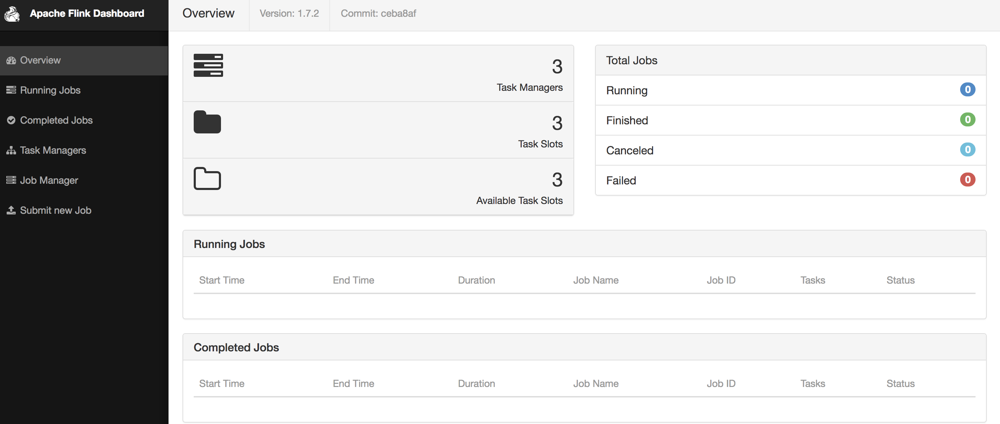

本文基于 Flink 1.7。

本文介绍搭建standalone HA 集群的过程，并且简单介绍核心配置。

## Requirements

* Java 1.8+
* ssh

注意：集群之间所有节点 无密SSH跳转与保持相同的目录结构将有助于使用Flink 提供的脚本。

## 版本选择

[下载](https://flink.apache.org/downloads.html) 合适版本的Flink安装包。Flink 并不要求一定要用到Hadoop 生态组件，如果要用到Hadoop 生态组件，建议下载于Hadoop 绑定的版本，在我们的场景中，用的是Hadoop2.6，所以这里选择`Apache Flink 1.7.2 with Hadoop® 2.6`。一般来说，Flink 的运行模式Yarn、以及savepoint/checkpoint 会用到HDFS，所以，采用与Hadoop 绑定的版本更常见一点。

## 配置Flink

我们这里配置Flink Standalone HA集群，集群包含5台机器，分别是testhadoop[1-5]，其中testhadoop[1-2]上运行Jobmanager，testhadoop[3-5]上运行Taskmanager。

配置 **./conf/masters** 文件，配置了Jobmanager，其中8081端口是Flink 的Rest 端口，该端口在下面的 ./conf/flink-conf.yaml 中配置。

```shell
$ cat masters
testhadoop1:8081
testhadoop2:8081
```

配置 **./conf/slaves** 文件，配置Taskmanagers 地址。

```shell
$ cat slaves
testhadoop3
testhadoop4
testhadoop5
```

配置 **./conf/flink-conf.yaml** 文件，注意，下面仅列出了对配置文件的更改，主要是HA方面的，该配置文件还有一些默认配置没有列出，具体的可以参考配置文件。

```yaml
jobmanager.rpc.address=testhadoop1   // Standalone HA Cluster模式下会被masters文件覆盖
high-availability: zookeeper                                    
high-availability.zookeeper.path.root: /flink_test            
high-availability.cluster-id: cluster_test
high-availability.storageDir: hdfs:///flink_test/ha/
high-availability.zookeeper.quorum: testhadoop1:2181
```

## 启动集群

```shell
./bin/start-cluster.sh
```


 可以看到，我们启动了一个HA集群，集群有2个master节点，分别位于testhadoop[1-2]上，启动了`standalonesession` 守护进程 ; 在testhadoop[3-5] 上，启动了`taskexecutor`守护进程。我们用浏览器打开testhadoop1:8081 ，如下图所示:



## 配置说明

下表介绍 `./conf/flink-conf.yaml` 中重要的配置项，具体完整版参考[配置页面](https://ci.apache.org/projects/flink/flink-docs-release-1.7/ops/config.html)。

| 属性                                  | 默认值     | 说明                                                         |
| ------------------------------------- | ---------- | :----------------------------------------------------------- |
| jobmanager.rpc.address                | localhost  | 仅 standalone 模式需要，表明jobmanager 所在host，如果是HA集群，用./bin/start_cluster.sh 时，该配置会被master文件覆盖。 |
| jobmanager.heap.size                  | 1024m      | Jobmanager的JVM heap size                                    |
| taskmanager.heap.size                 | 1024m      | Taskmanager的JVM heap size                                   |
| taskmanager.numberOfTaskSlots         | 1          | 每个Taskmanager的slot数，每个slot 可以运行一个并行pipeline。如果该值大于1，则可以运行多个并行pipeline。优点是可以充分利用多核CPU，缺点是各个slot会平分可用的内存，通常来说，这个值被设置为机器的物理CPU 核数。 |
| parallelism.default                   | 1          | Flink 任务默认的并行度                                       |
| high-availability                     | "NONE"     | 默认为NONE，但这并不适用于生产，所以，需要用zookeeper，      |
| high-availability.zookeeper.path.root |            | Flink 在 zookeeper中存储的root 地址                          |
| high-availability.cluster-id          | "/default" | Flink 集群的ID，用于区分不同集群，仅standalone 模式需要，Yarn/Mesos 可以自动推断。 |
| high-availability.storageDir          |            | HA 模式下，Flink 存储元数据的文件系统URI，我们常用HDFS 路径  |
| high-availability.zookeeper.quorum    |            | HA 用到的zookeeper的地址                                     |
| rest.port                             |            | rest 端口                                                    |
| state.backend                         |            | checkpoint的后端存储，支持jobmanager、filesystem和rocksdb，常用rocksdb |
| state.checkpoints.dir                 |            | checkpoint 的存储目录，比如HDFS 目录                         |
| state.savepoints.dir                  |            | savepoint 的存储目录，比如HDFS 目录                          |

## 总结

本文主要介绍Flink 的standalone 集群安装和配置，standalone 集群可以快速搭建，也能满足HA的要求。但是，在实际生产环境，可能更多的还是使用基于Yarn等资源管理器的Flink 集群。

到此，Flink 基础知识已经全部介绍，看到这里应该已经可以写一些简单的Flink 应用了。

[Flink(0)——基于flink的流计算](https://mp.weixin.qq.com/s/yQer9fQAyZXTaRdRhEyCDQ)

[Flink(1)——基于flink sql的流计算平台设计](https://mp.weixin.qq.com/s/8ICLIEzuGvDuzgOddXwTGg)

[Flink(2)——Apache Flink 介绍](https://mp.weixin.qq.com/s/4ySScrUpXTJoCtRP0feitg)

[Flink(3)——Event Time 与 Watermark](https://mp.weixin.qq.com/s/sJa3yGENCaDHd-LHz5jFsg)

[Flink(4)——Source 介绍与实践](https://mp.weixin.qq.com/s/jvveJR99vKQ11Jlr9mkMqA)

[Flink(5)——sink 介绍与实践](https://mp.weixin.qq.com/s/_W5uws9lFQn61VS7manFRQ)

[Flink(6)——flink table & sql 介绍](https://mp.weixin.qq.com/s/KZckw0wCuRt2O_NhmwbFkA)

[Flink(7)——Flink Standalone Cluster 安装与配置详解](http://lxwei.github.io/posts/Flink(7)-Flink-Standalone-Cluster-%E5%AE%89%E8%A3%85%E4%B8%8E%E9%85%8D%E7%BD%AE%E8%AF%A6%E8%A7%A3.html)